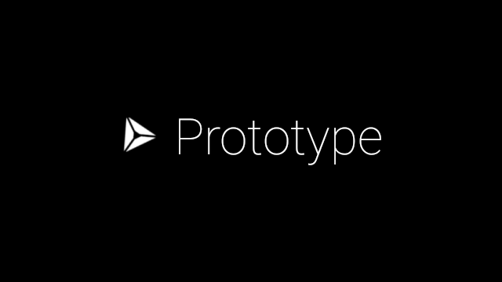

# RPPT Glass
Authored by [Kevin Chen](http://kevinchen.ninja), 2015.

Master repository located at [remote-paper-prototype-testing](https://github.com/NUDelta/remote-paper-prototype-testing). See that README for more extensive physical setup information.

## Requirements
Ensure that the package `com.google.zxing.client.android` (ZXing QR code reader) is on your Google Glass. I'm not sure, but it seems to be installed by default either by some OS of Glass or common apps.

## Usage
This application consists of two activities. In the first part, open up the menu (standard Glass controls: tap to open, swipe to scroll) and scan a QR code to connect to your video streaming session.

This will launch a second activity (might take a bit to load) that will be streaming your first person perspective to the web control panel. You'll have several controls, such as to pause, reconnect, and quit the stream.

## Customization
If you're using a custom deployment of the RPPT web control panel, make sure you alter `METEOR_URL` accordingly.

## Contact
[kevinchen2016@u.northwestern.edu](mailto:kevinchen2016@u.northwestern.edu)
